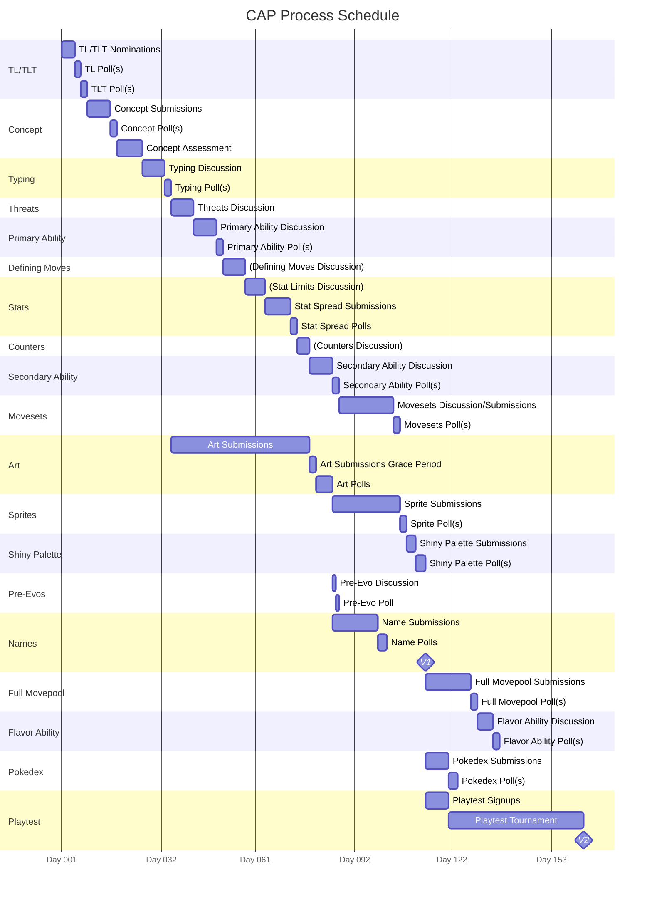

# Schedule

```mermaid
gantt

axisFormat Day %j
title CAP Process Schedule

section TL/TLT
TL/TLT Nominations : tl_thread, 2000-01-01, 4d
TL Poll(s): tl_poll, after tl_thread, 2d
TLT Poll(s): tlt_poll, after tl_poll, 2d

section Concept
Concept Submissions : concept_thread, after tlt_poll, 7d
Concept Poll(s): concept_poll, after concept_thread, 2d
Concept Assessment: concept_thread_2, after concept_poll, 8d

section Typing
Typing Discussion: typing_thread, after concept_thread_2, 7d
Typing Poll(s): typing_poll, after typing_thread, 2d

section Threats
Threats Discussion: threats_thread, after typing_poll, 7d

section Primary Ability
Primary Ability Discussion: ability1_thread, after threats_thread, 7d
Primary Ability Poll(s): ability1_poll, after ability1_thread, 2d

section Defining Moves
(Defining Moves Discussion): defining_moves_thread, after ability1_poll, 7d

section Stats
(Stat Limits Discussion): stat_limits_thread, after defining_moves_thread, 6d
Stat Spread Submissions: stats_thread, after stat_limits_thread, 8d
Stat Spread Polls: stats_poll, after stats_thread, 2d

section Counters
(Counters Discussion): counters_thread, after stats_poll, 4d

section Secondary Ability
Secondary Ability Discussion: ability2_thread, after counters_thread, 7d
Secondary Ability Poll(s): ability2_poll, after ability2_thread, 2d

section Movesets
Movesets Discussion/Submissions: movesets_thread, after ability2_poll, 17d
Movesets Poll(s): movesets_poll, after movesets_thread, 2d


%% Flavor

section Art
Art Submissions: art_thread, after typing_poll, 43d
Art Submissions Grace Period: art_gap, after art_thread counters_thread, 2d
Art Polls: art_poll, after art_gap, 5d

section Sprites
Sprite Submissions: sprite_thread, after art_poll, 21d
Sprite Poll(s): sprite_poll, after sprite_thread, 2d

section Shiny Palette
Shiny Palette Submissions: shiny_palette_thread, after sprite_poll, 3d
Shiny Palette Poll(s): shiny_palette_poll, after shiny_palette_thread, 3d

section Pre-Evos
Pre-Evo Discussion: prevo_thread, after art_poll, 1d
Pre-Evo Poll: prevo_poll, after prevo_thread, 1d

section Names
Name Submissions: name_thread, after art_poll, 14d
Name Polls: name_poll, after name_thread, 3d

V1: milestone, v1_milestone, after movesets_poll name_poll shiny_palette_poll sprite_poll, 1s


%% Post-Flavor

section Full Movepool
Full Movepool Submissions: movepool_thread, after v1_milestone, 14d
Full Movepool Poll(s): movepool_poll, after movepool_thread, 2d

section Flavor Ability
Flavor Ability Discussion: ability3_thread, after movepool_poll, 5d
Flavor Ability Poll(s): ability3_poll, after ability3_thread, 2d

section Pokedex
Pokedex Submissions: pokedex_thread, after v1_milestone, 7d
Pokedex Poll(s): pokedex_poll, after pokedex_thread, 3d

section Playtest
Playtest Signups: playtest_signups_thread, after v1_milestone, 7d
Playtest Tournament: playtest_tournament_thread, after playtest_signups_thread, 42d

V2: milestone, v2_milestone, after movepool_poll playtest_tournament_thread, 1s
```